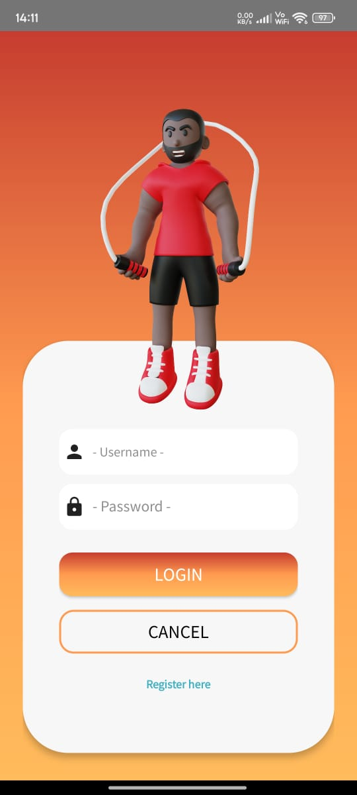
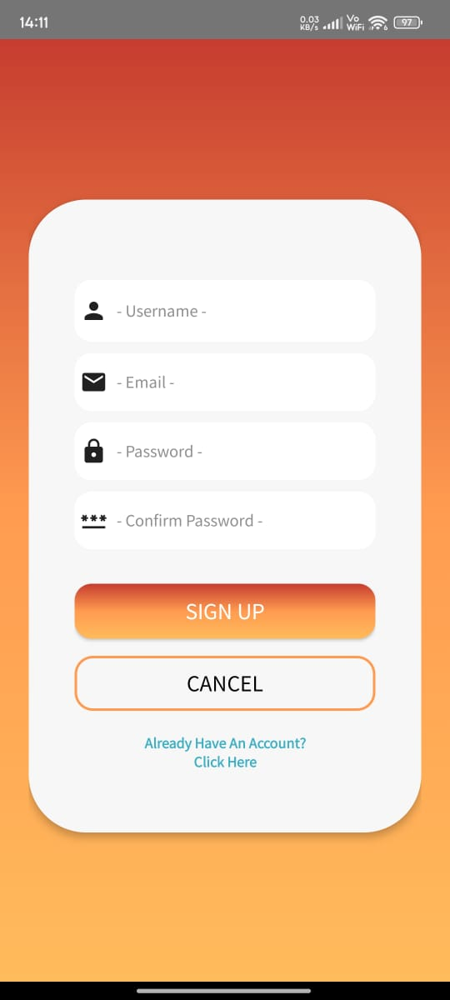
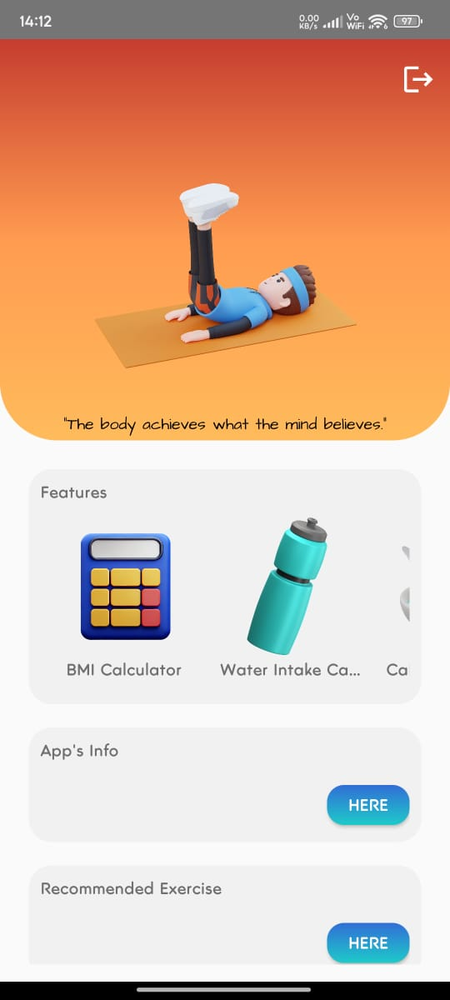
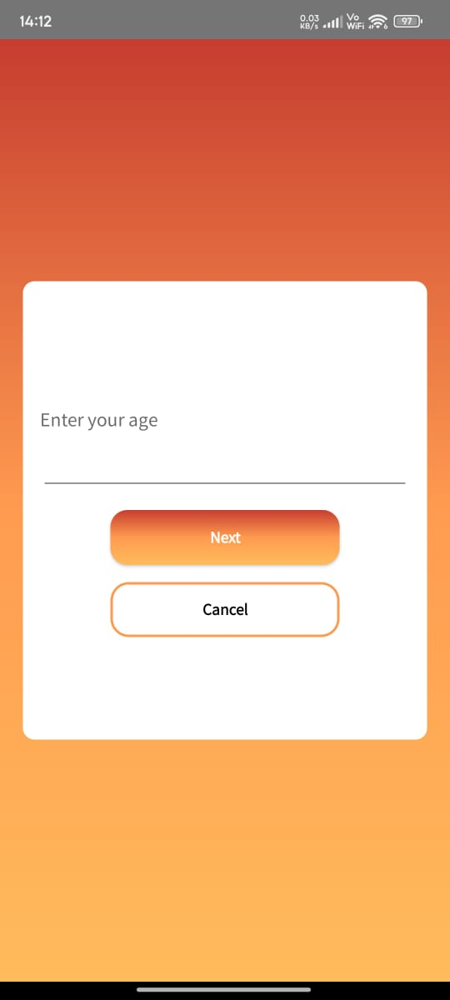
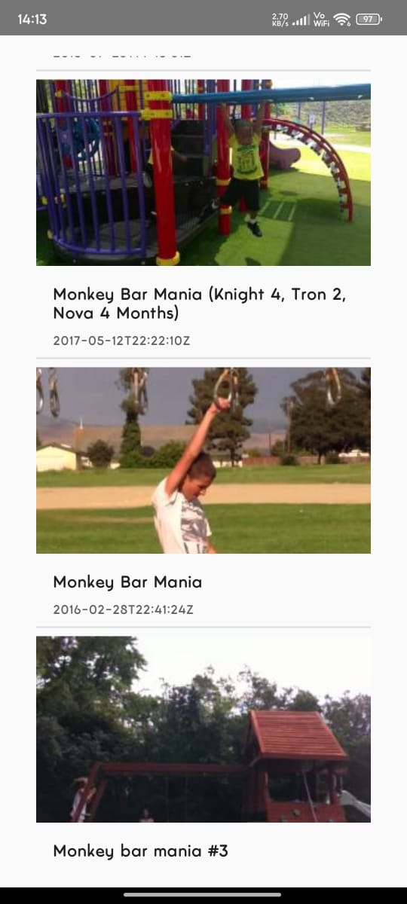

<h2 align="center">
  Fitness Recommendation Application
</h2>

This app aims to help users discover their preferred forms of exercise by offering features such as step tracking, a body mass index (BMI) calculator, and motivational recommendations. The primary goal of the app is to suggest suitable activities tailored to the user's condition, which is determined through a series of questions. Based on the user's responses, the app will display guided videos sourced from YouTube via API integration.

Below are the examples of user interface in this application

  
  
Login user interface
 
  
  
  
Register user interface
 
  
  
  
Main user interface
 
  
  
  
Question user interface (to know condition of user)
 
  
  
  
Videos of YouTube user interface (integrated by YouTube's API)
 

